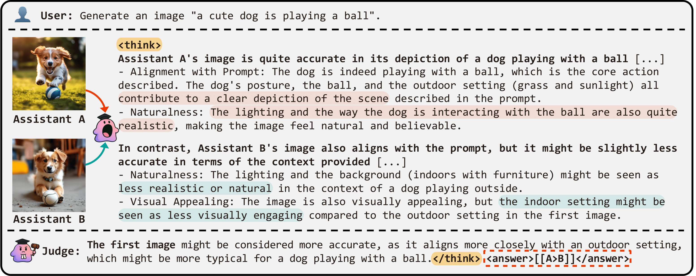
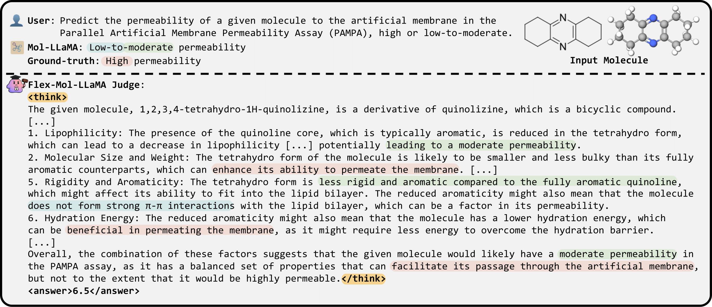

#   Flex-Judge: Think Once, Judge Anywhere
<a href="https://arxiv.org/abs/2505.18601"></a>
<a href=#bibtex></a>
<a href='https://huggingface.co/jongwooko/Flex-VL-7B'></a>
<a href='https://huggingface.co/jongwooko/Flex-Omni-7B'></a>

[**Flex-Judge: Think Once, Judge Anywhere**](https://arxiv.org/abs/2505.18601)       
[Jongwoo Ko](https://sites.google.com/view/jongwooko)<sup>1</sup>\*,
[Sungnyun Kim](https://sungnyunkim.notion.site/Sungnyun-Kim-4770a0182c47469ebdcd357cde97bd32)<sup>1</sup>\*,
[Sungwoo Cho](https://peter-sungwoocho.github.io/)<sup>1</sup>,
[Se-Young Yun](https://fbsqkd.github.io)<sup>1</sup><br/>
<sup>1</sup> KAIST AI, \* equal contribution

- We propose **Flex-Judge**, a reasoning-guided multimodal evaluator that leverages minimal textual reasoning data to robustly generalize across multiple modalities and evaluation formats.Add commentMore actions
- Our framework highlights reasoning-based text supervision as a powerful, cost-effective alternative to traditional annotation-intensive approaches, substantially advancing scalable, multimodal model-as-a-judge.


## 🔧 Install Requirements

Our training codebase is built upon the [s1 repo](https://github.com/simplescaling/s1). The following steps will guide you through the installation process.

First, create a conda virtual environment using:
```shell
conda create -n flex python=3.9 && conda activate flex
```

You can then install the remaining package dependencies of [s1](https://github.com/simplescaling/s1) as follows:

```shell
pip install -r requirements.txt
```

If you want to train `Flex-Omni-7B`, you’ll need to install a specific version of `transformers` released for [`Qwen2.5-Omni-7B`](https://huggingface.co/Qwen/Qwen2.5-Omni-7B),
```shell
pip uninstall transformers
pip install git+https://github.com/huggingface/transformers@v4.51.3-Qwen2.5-Omni-preview
pip install accelerate
```

You will also need Flash Attention 2 installed, which can be done by running:

```shell
python -m pip install flash-attn --no-build-isolation
```

## 🚀 Generation

1. Generate responses using the language model:

```shell
python utils/judgelrm_generation.py --seed 13 --temperature 0.1
```

2. Select only high-quality :

```shell
python lrm_process.py
```

You should select the training samples based on longer reasoning and by considering format divergence. We have also attached the final data in `data/train.jsonl`.

## 🏋️ Training Flex-Judge

We provide four training config files for the four training setups reported in our paper. The training config is set for 2xA6000 or 4xA6000 GPUs. You may need to adjust `num_processes` and `per_device_train_batch_size` based on your computation environment.

* Flex-VL-7B (4xA6000):
```Shell
bash train/vl.sh
```

* Flex-Omni-7B (4xA6000):
```Shell
bash train/omni.sh
```

## 📊 Evaluation

For our evaluation benchmark, we use MLLM-as-a-Judge, VL-RewardBench, MJ-Bench, and GenAI-Bench for vision tasks. All responses are generated using vLLM.

To run `Flex-VL-7B`, create a conda environment with the latest version of `vllm`:
```shell
conda create -n vllm python=3.11 && conda activate vllm
pip install vllm==0.8.5
```

To run Flex-Omni-7B -- which is used for audio tasks such as NISQA, BVCC, SOMOS, and VoxSim, and is also compatible with vision tasks -- create a separate environment named `vllm-omni`:

```shell
conda create -n vllm-omni python=3.11 && conda activate vllm-omni
pip install git+https://github.com/huggingface/transformers@v4.51.3-Qwen2.5-Omni-preview
pip install vllm==0.8.5
```

1. Generate responses from the prompts:

```shell
python test/{benchmark}_vllm.py --ckpt $CKPT --split $SPLIT
```

For example, you can generate judge results for image edition task of GenAI-Bench as follows:

```shell
python test/genai_bench_vllm.py --ckpt ckpts/vl --split editing
```

or, for NISQA speech quality assessment:

```shell
python test/nisqa_vllm.py --ckpt ckpts/omni --root /path/to/nisqa
```

2. Evaluate the judge results against human (or GPT-4) evaluations. For example:

```shell
python test/evaluate.py --benchmark genai_bench --model ckpts/vl --split editing
```

Change `benchmark` to evaluate on other benchmarks.

### 📚 Resources
Here are the resources for evaluation benchamarks such as MLLM-as-a-Judge, MJ-Bench, GenAI-Bench, as follows:

* MLLM-as-a-Judge: Please refer to the [MLLM-as-a-Judge repo](https://github.com/Dongping-Chen/MLLM-Judge/tree/main/Dataset) for evaluation.

* VL-RewardBench: Please refer to to the [VL-RewardBench huggingface](https://huggingface.co/datasets/MMInstruction/VL-RewardBench) for evaluation.

* MJ-Bench: Please refer to the [MJ-Bench huggingface](https://huggingface.co/datasets/MJ-Bench/MJ-Bench) for evaluation.

* GenAI-Bench: Please refer to the [GenAI-Bench huggingface](https://huggingface.co/datasets/TIGER-Lab/GenAI-Bench/viewer/video_generation) for evaluation.

* Audio benchmarks: Please refer to the [ByteDance/SALMONN repo](https://github.com/bytedance/SALMONN/blob/main/quality_assessment/README.md) for data setup and evaluation.

> `Disclaimer: We're currently fixing our code for VL-RewardBench and MJ-Bench as the original datasets have recently been changed.`

## 🧪 Examples

- An example for assessing image generation



- We also provide a molecule-specific evaluator called **Flex-Mol-LLaMA**. To use our Flex-Mol-LLaMA judge model for Best-of-N sampling and DPO training, refer to `example/README.md`.



## 📖 BibTeX
If you find this repo useful for your research, please consider citing our paper:

```
@article{ko2025flex,
  title={Flex-Judge: Think Once, Judge Anywhere},
  author={Ko, Jongwoo and Kim, Sungnyun and Cho, Sungwoo and Yun, Se-Young},
  journal={arXiv preprint arXiv:2505.18601},
  year={2025}
}
```

## 📬 Contact
- Jongwoo Ko: jongwoo.ko@kaist.ac.kr
- Sungnyun Kim: ksn4397@kaist.ac.kr
